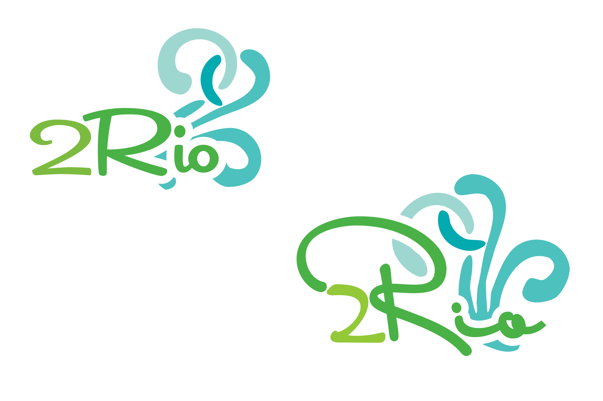

---

title: 2Rio

summary: Logo for a beachwear store.

tags:

  - logo

date: '2016-04-27T00:00:00Z'

# Optional external URL for project (replaces project detail page).

external_link: ''

image:

  caption: 2Rio logo

  focal_point: Smart

links:

url_code: ''

url_pdf: ''

url_slides: ''

url_video: ''

# Slides (optional).

#   Associate this project with Markdown slides.

#   Simply enter your slide deck's filename without extension.

#   E.g. `slides = "example-slides"` references `content/slides/example-slides.md`.

#   Otherwise, set `slides = ""`.

# slides: example

---

