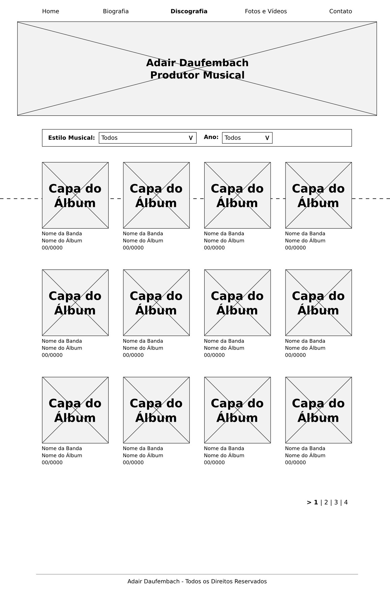
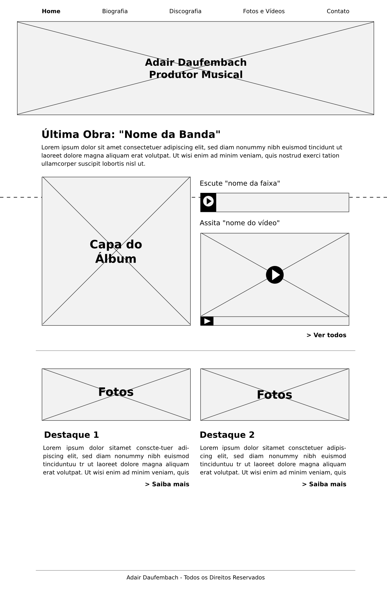

---

title: Adair Daufembach

summary: Website made in Wordpress for music producer Adair Daufembach.

tags:
  - design
  - web

date: '2016-04-27T00:00:00Z'

# Optional external URL for project (replaces project detail page).

external_link: ''

image:
  caption:
  focal_point: Smart

links:
url_code: ''
url_pdf: ''
url_slides: ''
url_video: ''

# Slides (optional).
#   Associate this project with Markdown slides.
#   Simply enter your slide deck's filename without extension.
#   E.g. `slides = "example-slides"` references `content/slides/example-slides.md`.
#   Otherwise, set `slides = ""`.
# slides: example

---

Website made in Wordpress for music producer Adair Daufembach. It is not online anymore (he does not have a website at all anymore, only social networks).

